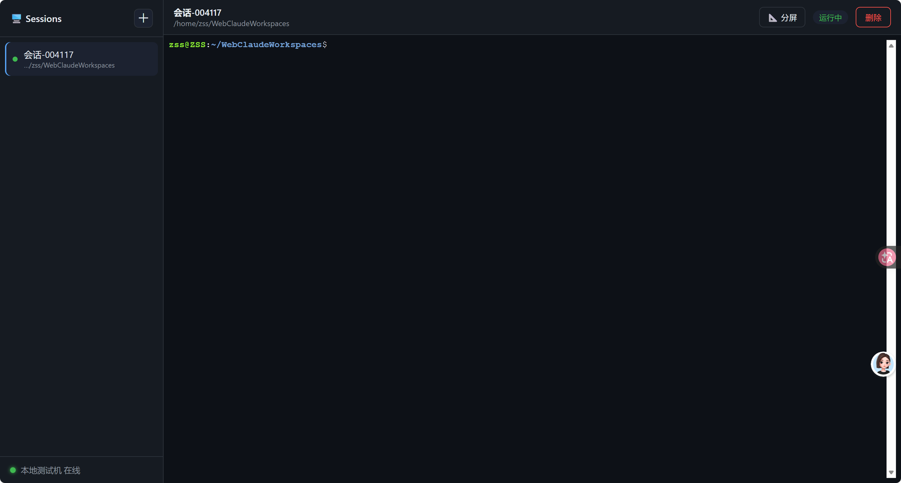

# 🌐 Web-Claude

> 🖥️ 在任何设备的浏览器里，远程操作你电脑的终端。手机、平板、笔记本都可以——打开网页，就像坐在电脑前。



---

## ✨ 功能特性

- 🖥️ **真正的交互式终端** — 基于 [xterm.js](https://xtermjs.org/) + [node-pty](https://github.com/microsoft/node-pty)，支持完整 shell 体验：颜色、`vim`、`top`、Tab 补全、Ctrl-C、历史命令
- 🗂️ **多会话管理** — 同时开多个终端，各自独立工作目录，来回切换互不干扰
- 📂 **会话绑定工作目录** — 每个会话自动创建独立的文件夹，命令在各自目录下执行
- 🔁 **断线重连 + 历史回放** — 切换会话或刷新页面后，之前的输出自动恢复，不会丢失
- 🔒 **Token 鉴权** — 一个 Token 绑定一台设备，浏览器输入对应 Token 就连到对应设备
- 📱 **全平台通用** — 只要有个浏览器就能用，手机/平板/笔记本无需装 App
- 🤖 **支持 Claude Code** — 在网页终端里直接输入 `claude`，进入交互式 AI 编程
- ⚡ **实时输出** — 终端内容实时回传浏览器，几乎感觉不到延迟

---

## 🏗️ 架构

```
┌─────────────────────────────────────────────────────────┐
│  📱 手机/平板/笔记本          ☁️ 云服务器               │
│  ┌─────────────┐            ┌──────────────┐           │
│  │  浏览器      │──WSS────→ │  Nginx :3000 │           │
│  │  xterm.js   │            │  (HTTPS)     │           │
│  └─────────────┘            │      ↓       │           │
│                             │  Server:3002 │           │
│                             │  (中继转发)   │           │
│                             └──────┬───────┘           │
│                                    │                   │
│  💻 你的电脑                        │                   │
│  ┌─────────────┐                   │                   │
│  │  Agent      │←────WS───────────┘                   │
│  │  node-pty   │                                       │
│  │  bash/zsh   │  ← 命令在这里真正执行！                │
│  └─────────────┘                                       │
└─────────────────────────────────────────────────────────┘
```

**三个角色，各司其职：**

| 组件 | 跑在哪 | 干什么 | 不干什么 |
|------|--------|--------|----------|
| **🌐 浏览器** | 任意设备 | 展示终端 UI，采集键盘输入 | 不执行命令 |
| **☁️ Server** | 云服务器 | 托管页面、Token 鉴权、中继转发消息 | 不执行命令 |
| **💻 Agent** | 你想控制的电脑 | 开 shell、执行命令、回传输出 | 不对外暴露端口 |

> ⚠️ **命令只在 Agent 所在机器上执行**。Server 只是中转站。

---

## 🚀 快速开始

### 第一步：云服务器部署 Server

```bash
# 1. 克隆仓库
git clone https://github.com/BUG423/Web-Claude.git
cd Web-Claude

# 2. 创建配置
cp config.json.example config.json
# 编辑 config.json：生成 Token、改成你的服务器 IP

# 3. 部署到服务器（前提：已配 SSH 免密登录）
SERVER_HOST=你的服务器IP SERVER_SSH_PORT=822 bash deploy.sh

# 4. 如果有域名，配置 HTTPS
ssh root "certbot --nginx -d 你的域名"
```

### 第二步：本地电脑启动 Agent

```bash
cd Web-Claude
cp config.json.example config.json   # 填好服务器地址和 Token
cd agent && npm install

# 启动（HTTPS 时需要 CW_USE_WSS=true）
CW_USE_WSS=true node index.js
# 或后台运行
CW_USE_WSS=true pm2 start index.js --name claude-web-agent && pm2 save
```

### 第三步：浏览器打开

```
https://你的域名:3000          （推荐，有 HTTPS）
http://服务器IP:3000           （仅测试用）
```

输入你的 Token → 点左上角 **＋** 新建会话 → 开始使用 🎉

---

## ⚙️ 配置说明

```jsonc
{
  // ── Server 端 ──
  "port": 3002,                    // Server 内部监听端口
  "bindHost": "127.0.0.1",        // 仅本机（Nginx 在前）
  "tokens": {                     // 多设备 Token 映射
    "token-设备A": "办公室台式机",
    "token-设备B": "家里笔记本",
    "token-设备C": "备用设备"
  },

  // ── Agent 端 ──
  "serverHost": "你的服务器IP或域名",  // Agent 连哪里
  "serverPort": 3000,                 // 对外端口（Nginx 端口）
  "useTLS": false,                    // Nginx 管 TLS，这里关掉
  "workspaceRoot": "~/WebClaudeWorkspaces"  // 会话的工作目录根路径
}
```

生成强随机 Token：

```bash
node -e "console.log(require('crypto').randomBytes(24).toString('base64url'))"
```

### 环境变量

| 变量 | 作用 | 示例 |
|------|------|------|
| `CW_USE_WSS=true` | Agent 用 WSS 连接（HTTPS 时需要） | `CW_USE_WSS=true` |
| `CW_CONFIG_PATH=/path/config.json` | 指定 Server/Agent 配置文件路径（测试和多环境部署时使用） | `CW_CONFIG_PATH=/tmp/config.json` |
| `CW_MAX_WS_PAYLOAD_BYTES=1048576` | Server WebSocket 单消息大小上限 | `1048576` |

### 测试

```bash
# 安装云端 Server 依赖
cd server && npm ci && cd ..

# 跑不依赖 node-pty 的单元/协议测试
npm test
```

Agent 依赖 `node-pty`，如果当前 Node 版本没有可用预编译包，需要系统具备编译工具：

```bash
sudo apt-get install -y build-essential python3
cd agent && npm ci
```

完整端到端测试需要本地 Server 和 Agent 都在线：

```bash
node tests/e2e.js
node tests/security.js
```

---

## 🔒 安全贴士

- ✅ `config.json` 已加入 `.gitignore`，Token 不会上传 GitHub
- ✅ 启用 HTTPS + Nginx 反向代理，不直接暴露 Node.js 端口
- ✅ 会话工作目录被限制在 `workspaceRoot` 内，无法越界
- ⚠️ 网页终端等同于暴露 shell，请使用强随机 Token
- ⚠️ 建议用低权限用户运行 Agent

---

## ❓ 常见问题

**Q: 前端显示 Agent 离线？**

检查：Agent 是否在运行、Token 两端是否一致、`serverHost` 是否正确、服务器安全组是否放行 3000 端口。

**Q: 同时开两个 Agent 会怎样？**

后连的踢掉先连的。一个 Server 同一时间只服务一个 Agent，避免会话混乱。

**Q: 怎么确认 Agent 在控制哪台机器？**

看 Agent 日志，或 `curl https://服务器:3000/health`，`agentsOnline` 显示当前连接的 Agent 数量。

**Q: 删除会话会删文件吗？**

默认只关闭终端、保留目录。勾选"同时删除文件"才会清理目录，且仅限 `workspaceRoot` 以内。

**Q: node-pty 安装失败？**

缺少编译工具。`sudo apt install -y build-essential python3` 后重试。

---

## 📄 许可证

MIT License — 详见 [LICENSE](LICENSE)
